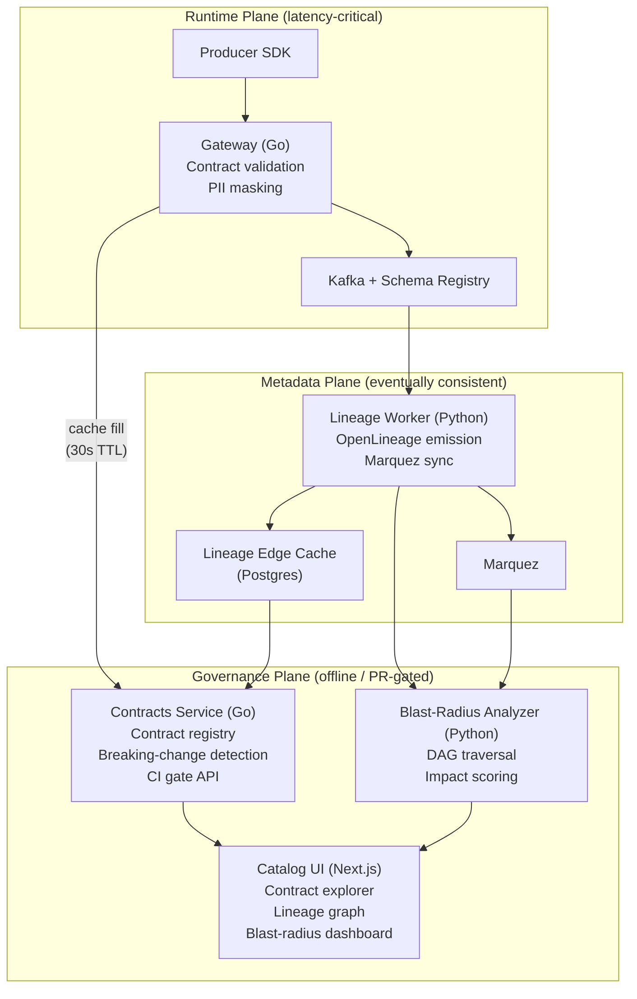
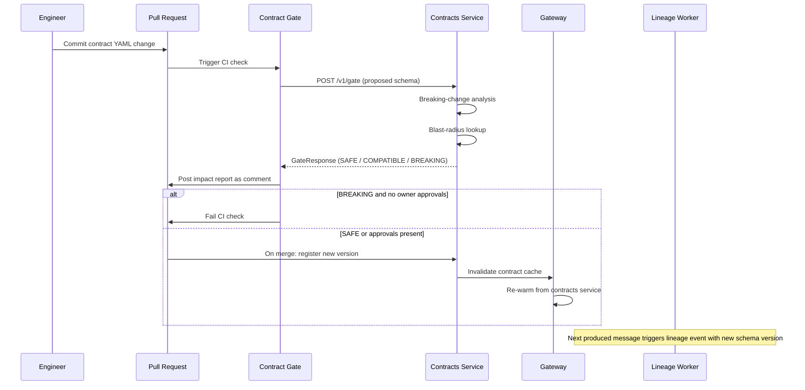
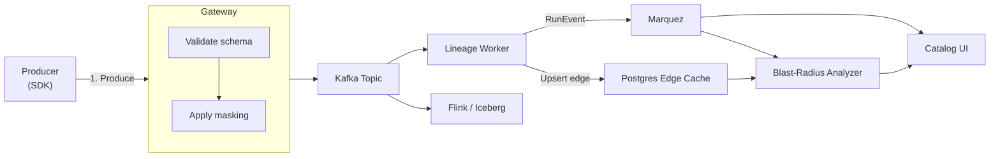
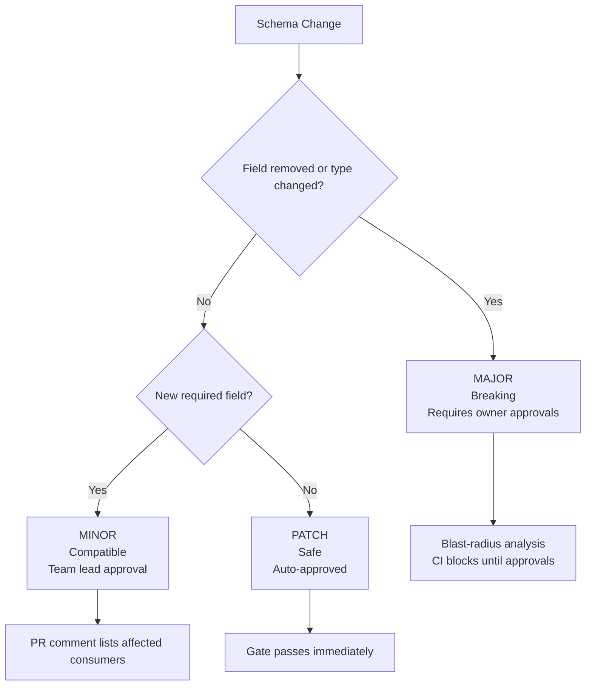
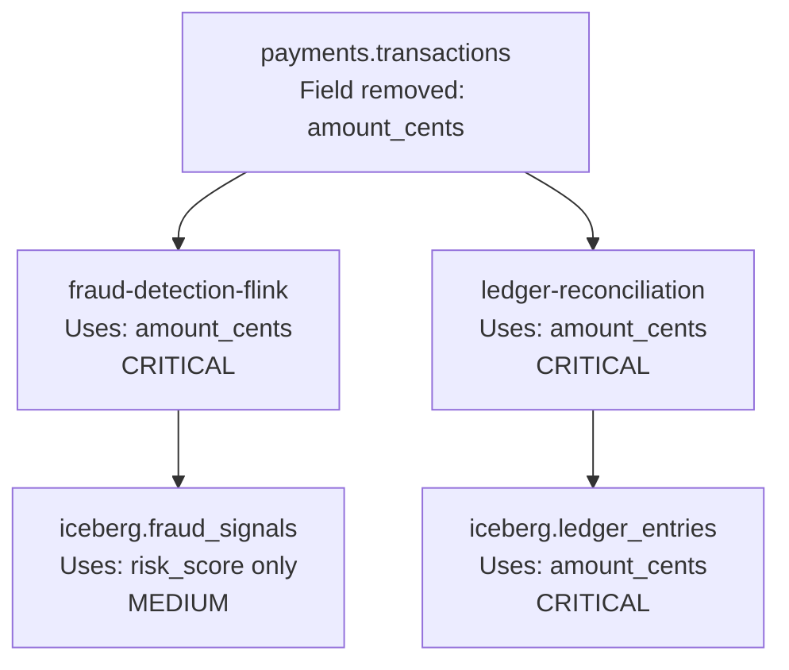

# Mzigo

**Streaming Data Contracts and Lineage Control Plane for the Lakehouse Era**

[](https://github.com/sogodongo/mzigo/actions/workflows/ci.yml)
[](https://github.com/sogodongo/mzigo/actions/workflows/contract-gate.yml)
[](LICENSE)

Mzigo enforces data contracts at stream ingestion time, tracks column-level lineage across your lakehouse, and gives platform teams blast-radius visibility before a schema change reaches production.

If a producer drops a required field, changes a type incompatibly, or introduces a PII column without a masking policy, Mzigo blocks it at the gateway, not at 3am when your Flink job crashes.

---

## Why This Exists

Schema registries tell you what a schema looks like. They do not tell you:

- Whether that schema change breaks 14 downstream Flink jobs
- Which Iceberg tables will receive malformed data
- Whether a new field contains PII that needs masking before it lands
- Who owns the contract and approved the change
- What the blast radius is if you let it through

Mzigo fills that gap. It sits between your producers and your streaming infrastructure, enforces contracts at runtime, and emits lineage events that power a real governance layer.

---

## Architecture

Mzigo separates concerns into three planes. The separation is not cosmetic: the runtime plane has a latency budget measured in milliseconds. The metadata plane is eventually consistent. Coupling them would mean a slow lineage write adds latency to every message produced.



### Runtime Path

Every message produced through the Mzigo SDK hits the Gateway. The Gateway validates the payload against the active contract, applies any masking policies, and forwards to Kafka. Contract data is cached in-process. Validation makes no network calls on the hot path.

Target: **less than 5ms p99 added latency** on the validation path.

### Metadata Path

A separate Lineage Worker consumes from Kafka topics, extracts field-level metadata, and emits OpenLineage events to Marquez. This path is fully decoupled from the runtime path. A lineage worker failure causes lineage lag, not producer failures.

### Governance Path

Contract changes flow through a CI gate. The `contract-gate` GitHub Action calls the Contracts service to run breaking-change detection and blast-radius analysis before any schema change merges. Breaking changes require explicit approval from affected team owners.

---

## Contract Lifecycle



---

## Data Flow



---

## Services

| Service | Language | Role | Port |
|---|---|---|---|
| `gateway` | Go | Runtime validation, masking, Kafka proxy | 8080 |
| `contracts` | Go | Contract registry, versioning, CI gate API | 8081 |
| `lineage` | Python | OpenLineage emission, Marquez integration | metrics: 9102 |
| `analyzer` | Python | Blast-radius, breaking-change analysis | 8083 |
| `masking` | Go | PII detection, dynamic field masking | 8084 |
| `catalog` | TypeScript/Next.js | Developer UI, contract explorer, lineage graph | 3000 |

---

## Governance Model

Contracts use semantic versioning: `MAJOR.MINOR.PATCH`



---

## Blast-Radius Analysis

When a breaking schema change is proposed, the analyzer traverses the lineage DAG from the affected topic and scores each downstream consumer by field intersection.



Impact levels: **CRITICAL** (uses changed fields), **HIGH** (direct reader, no field data), **MEDIUM** (downstream path), **NONE** (no field intersection).

---

## Observability Stack

| Layer | Tool | Coverage |
|---|---|---|
| Traces | OpenTelemetry + Tempo | Gateway validation spans, produce latency |
| Metrics | Prometheus + Grafana | Contract violations, cache hit rate, masking volume |
| Logs | zerolog/structlog + Loki | Structured JSON, queryable by topic/producer |
| Lineage | OpenLineage + Marquez | Dataset and job relationships, column-level lineage |
| Alerts | Alertmanager | Sustained violation rate, cache failures, consumer lag |

---

## Local Development

Requires: Docker Desktop, Make

```bash
git clone https://github.com/sogodongo/mzigo
cd mzigo
make dev-up          # Start full local stack
make dev-seed        # Load example contracts and schemas
make dev-produce     # Run example producer against gateway
make dev-lineage     # Open Marquez UI in browser
```

Local stack: Kafka, Schema Registry, Postgres, Marquez, Prometheus, Grafana, Loki, OpenTelemetry Collector.

---

## Kubernetes Deployment

```bash
cd infra/helm
helm dependency update mzigo/
kubectl create namespace mzigo
helm install mzigo ./mzigo \
  --namespace mzigo \
  --values mzigo/values.production.yaml.example
```

Full configuration reference: [infra/helm/README.md](infra/helm/README.md)

---

## Cloud Infrastructure (AWS)

```bash
cd infra/terraform
terraform init
terraform apply -var-file=environments/staging.tfvars
```

Provisions: MSK cluster with KMS encryption, RDS Postgres with Secrets Manager credentials, S3 lineage and audit retention buckets, VPC with per-AZ NAT gateways, IRSA IAM roles for all services.

---

## Security Model

- All inter-service communication uses mTLS inside the cluster
- Gateway authenticates producers via signed JWT with contract scope claims
- PII field classification enforced by policy, not producer declaration
- Contract mutations require audit-logged approval chain
- IRSA: each service assumes a scoped IAM role with minimum permissions
- MSK: TLS in-transit, KMS at-rest encryption
- RDS: KMS encryption, credentials in Secrets Manager only
- `readOnlyRootFilesystem: true` on all containers, non-root UID 1000

---

## Architecture Decisions

| ADR | Decision |
|---|---|
| [ADR-001](docs/architecture/adr/ADR-001-plane-separation.md) | Runtime and metadata planes are fully decoupled |
| [ADR-002](docs/architecture/adr/ADR-002-language-selection.md) | Go for latency-critical services, Python for analytical workloads |

---

## Repository Structure

```
mzigo/
├── services/
│   ├── gateway/         Go: runtime hot path
│   ├── contracts/       Go: governance control plane
│   ├── lineage/         Python: OpenLineage emission
│   ├── analyzer/        Python: blast-radius analysis
│   ├── masking/         Go: PII masking
│   └── catalog/         TypeScript/Next.js: developer UI
├── sdk/python/          Producer SDK
├── infra/
│   ├── terraform/       AWS infrastructure
│   ├── helm/            Kubernetes charts
│   └── docker/          Local dev compose stack
└── docs/architecture/   ADRs and design documents
```

---

## License

Apache 2.0
